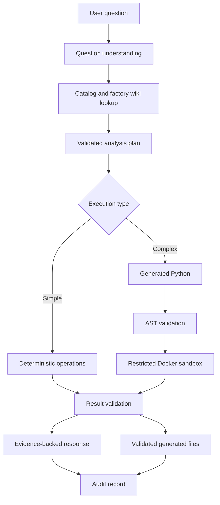

# Industrial Data Agent

A safety-first, CLI-based data agent for asking natural-language questions about production orders, machine availability, and inventory.

Industrial Data Agent uses Google Gemini for planning when configured, while a validation harness controls what can be executed and what evidence may be returned. A deterministic offline mode makes the project easy to evaluate without an API key or network access.

> Project status: v0.1 hackathon prototype. The supported product is the CLI and all data operations are read-only. The security boundary has not been independently audited.

## Why this project

Industrial teams often have operational data spread across CSV and Excel files. Answering a simple question such as "Which high-priority orders are blocked?" can require filtering orders, checking machine availability, comparing material requirements, and producing a report.

This project turns that workflow into a controlled agent pipeline:

- Natural-language questions become structured, validated plans.
- Simple questions use deterministic data operations.
- Complex analysis code is checked with Python AST rules before execution.
- Docker runs generated code without network access or host secrets.
- Final answers include validated evidence and generated files only.
- An offline fallback provides a reproducible demonstration.

## Key features

- Questions over orders, machines, and inventory
- Gemini-backed planning with a configurable model name
- Deterministic offline mode with no API key or network requirement
- CSV and Excel ingestion with required-column validation
- Persistent factory wiki for context and provenance
- Restricted Python sandbox for complex analysis
- Evidence-backed CLI responses
- CSV, Excel, JSON, PDF, and chart generation
- Audit records and safe Gemini diagnostics

## Quick start: offline demo

The offline demo is the fastest way to evaluate the project.

```bash
git clone https://github.com/Jayaragul/factory-gpt-.git industrial-data-agent
cd industrial-data-agent
python -m venv .venv
```

Activate the environment:

```powershell
# Windows PowerShell
.venv\Scripts\Activate.ps1
```

```bash
# macOS or Linux
source .venv/bin/activate
```

Install dependencies and run the deterministic demo:

```bash
python -m pip install --upgrade pip
python -m pip install -e .
python demo.py
```

The demo runs five representative questions and creates a CSV report using bundled sample data.

The bundled CSV files are a fixed synthetic snapshot dated 2026-07-25. They are demonstration data, not live factory telemetry.

## Interactive CLI

```bash
python bot.py
```

Inside the CLI, use `/help`, `/examples`, and `/status` for commands and runtime diagnostics.

Example questions:

```text
How many high priority orders are there?
What orders are delayed?
Which machines are idle?
What materials are below reorder level?
Create a CSV report for high priority orders.
```

Useful commands:

| Command | Purpose |
|---|---|
| `/ingest orders "path/to/orders.csv"` | Load and validate an orders file |
| `/ingest machines "path/to/machines.xlsx"` | Load and validate a machines file |
| `/ingest inventory "path/to/inventory.csv"` | Load and validate an inventory file |
| `/data` | Show active uploaded datasets |
| `/wiki lint` | Check the factory wiki state |
| `/debug on` | Show safe runtime diagnostics |
| `/debug off` | Hide runtime diagnostics |
| `exit` or `quit` | Close the CLI |

## Live Gemini setup

Copy the environment template:

```powershell
# Windows
copy .env.example .env
```

```bash
# macOS or Linux
cp .env.example .env
```

Configure the file:

```env
GEMINI_API_KEY=your_key
GEMINI_MODEL=your_configured_model
GEMINI_TEMPERATURE=0
INDUSTRIAL_AGENT_OFFLINE_MODE=false
```

The model is never hardcoded; it is read from `GEMINI_MODEL`.

For a local presentation without Gemini, use:

```env
INDUSTRIAL_AGENT_OFFLINE_MODE=true
```

If a live request returns `GEMINI_UNAVAILABLE`, inspect `runtime/logs/gemini.log`. The diagnostic log does not store API keys.

## Bring your own data

Uploaded CSV or Excel files are validated before they become active. The agent stores normalized copies under `runtime/ingested` and uses them for later questions.

### Orders schema

| Column | Meaning |
|---|---|
| `order_id` | Unique order identifier |
| `product` | Product or item name |
| `order_quantity` | Total requested quantity |
| `completed_quantity` | Quantity already completed |
| `status` | Current order status |
| `due_date` | Required completion date |
| `required_machine_type` | Machine type needed for production |
| `assigned_machine_ids` | Assigned machine identifiers |
| `required_material_id` | Required material identifier |
| `required_material_quantity` | Required material quantity |
| `priority` | Order priority |

### Machines schema

| Column | Meaning |
|---|---|
| `machine_id` | Unique machine identifier |
| `machine_type` | Machine category |
| `status` | Current operating status |
| `capacity_per_hour` | Nominal hourly capacity |
| `efficiency_percent` | Current efficiency percentage |
| `next_available_at` | Next expected availability |
| `health_score` | Machine health indicator |

### Inventory schema

| Column | Meaning |
|---|---|
| `material_id` | Unique material identifier |
| `material_name` | Material name |
| `available_quantity` | Quantity currently available |
| `reserved_quantity` | Quantity already reserved |
| `reorder_level` | Replenishment threshold |
| `unit` | Measurement unit |
| `last_updated` | Data freshness timestamp or date |

## How it works



The factory wiki provides context and provenance. Validated active CSV data remains the source of truth for counts, dates, quantities, and operational conclusions.

## Sandbox and safety model

Generated analysis code may only:

- Read approved files from `/sandbox/input`
- Write final artifacts to `/sandbox/output`
- Use `/sandbox/work` for temporary files

The validator rejects unsafe imports and operations, including network access, subprocesses, shell commands, dynamic imports, environment-variable access, unsafe serialization, `eval`, `exec`, `compile`, and unapproved paths.

Build the sandbox image:

```bash
docker build -t industrial-data-agent-sandbox sandbox
```

Docker runs without network access, privileged mode, or host secrets, and applies CPU and memory limits.

For tests only, a local sandbox fallback can be enabled with `INDUSTRIAL_AGENT_ALLOW_LOCAL_SANDBOX=true`. Do not use the local fallback for sensitive or production analysis.

## Generated outputs

Files are generated only when requested or required by the analysis:

- CSV detail reports
- Excel workbooks
- JSON results
- PDF reports created with ReportLab
- Matplotlib charts

Artifacts are stored under `runtime/outputs/<request_id>/` and validated before their paths are shown.

## Project structure

```text
agent/          Planning, orchestration, execution, and response logic
data/           Ingestion, validation, normalization, and sample datasets
gemini/         Gemini client, prompts, schemas, and function declarations
harness/        Tool registry, permissions, plan validation, and audit logging
knowledge/      Persistent factory wiki implementation
llm_wiki/       Dataset semantics, relationships, formulas, and examples
sandbox/        AST rules, Docker image, runner, and result validation
tests/          Agent-flow, pipeline, security, and sandbox tests
tools/          Approved tool implementations
bot.py          Interactive CLI
demo.py         Deterministic two-minute demo
ARCHITECTURE.md Security boundaries and system overview
```

## Testing

Run the complete test suite when Docker is available:

```bash
python -m pip install -e . pytest
python -m pytest -q -p no:cacheprovider
```

Run non-sandbox tests without Docker:

```powershell
$env:INDUSTRIAL_AGENT_OFFLINE_MODE="true"
python -m pytest -q -k "not sandbox"
```

```bash
INDUSTRIAL_AGENT_OFFLINE_MODE=true python -m pytest -q -k "not sandbox"
```

## Current limitations

- The supported interface is the CLI.
- The built-in catalog supports orders, machines, and inventory schemas.
- Gemini availability and output quality depend on the configured model and account.
- The Docker sandbox is a defense-in-depth boundary, not a formal security guarantee.
- Sample data is fictional and must not be treated as live factory evidence.
- Large datasets and long-running analyses have not yet been benchmarked publicly.

## Roadmap

- Add a packaged `industrial-data-agent` console command
- Add GitHub Actions CI and test coverage reporting
- Add a schema-mapping assistant for differently named columns
- Publish benchmark datasets and expected-answer tests
- Add richer terminal help and example discovery
- Add signed release artifacts and a documented threat model
- Add pluggable storage connectors while keeping read-only execution

## Contributing

Contributions are welcome after the repository has a license and contribution policy. Good first contributions include additional deterministic intents, ingestion validation, documentation, test cases, and sandbox hardening.

See `CONTRIBUTING.md` for the development workflow.

## Responsible use

This project is intended for demonstrations, prototypes, and controlled read-only analysis. Review the code, data-handling rules, model configuration, and sandbox controls before using it with confidential, regulated, or production data.
